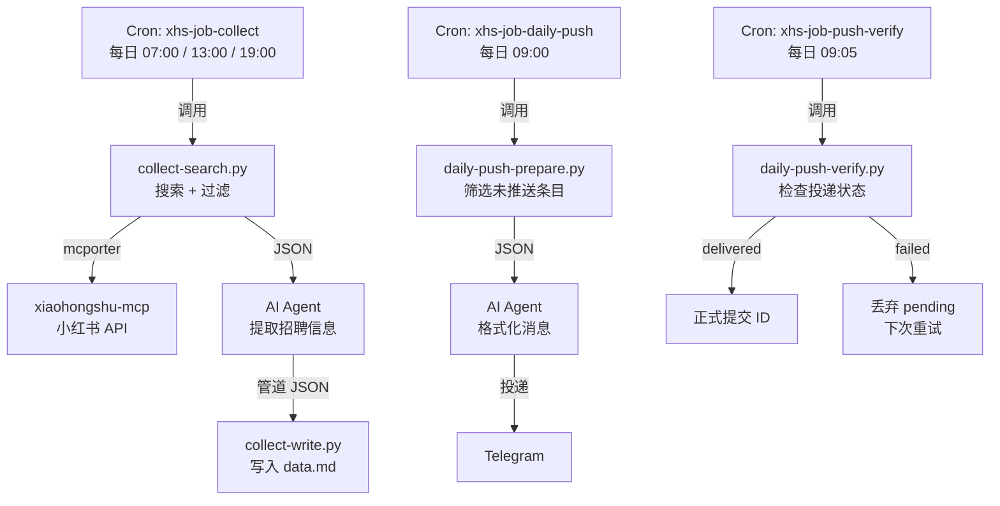

# XHS Job Radar - 小红书招聘雷达

自动从小红书采集招聘信息，每日推送到 Telegram。基于 [OpenClaw](https://openclaw.ai) AI 消息网关 + [xiaohongshu-mcp](https://github.com/ptp-build/xiaohongshu-mcp) 实现全自动运行。

## 工作原理

```
小红书 ←──搜索──  collect-search.py ──→ AI Agent ──→ collect-write.py ──→ data.md
                        ↑                                                    ↓
                   mcporter CLI                                    daily-push-prepare.py
                        ↑                                                    ↓
                  xiaohongshu-mcp                                  AI Agent 格式化
                                                                             ↓
                                                                    Telegram 推送
                                                                             ↓
                                                                  daily-push-verify.py
                                                                   (投递确认/回滚)
```

## 架构总览



## 核心特性

- **全自动采集**：每日 3 次从小红书搜索招聘帖，按时段轮换关键词
- **智能分类**：自动区分招聘帖 / 面经 / 不相关内容，减少噪声
- **日报推送**：每早 9:00 将新增招聘信息格式化推送到 Telegram
- **两阶段提交**：推送失败时自动回滚，不丢失未推送数据
- **低 Context 消耗**：Python 脚本预处理数据，LLM 只做格式化，单次运行仅 ~12k tokens

## 前置依赖

| 组件 | 说明 |
|------|------|
| [OpenClaw](https://openclaw.ai) | AI 消息网关，提供 Cron、Agent、Telegram 投递能力 |
| [xiaohongshu-mcp](https://github.com/ptp-build/xiaohongshu-mcp) | 小红书 MCP 服务端（Go + go-rod） |
| [MCPorter](https://docs.openclaw.ai/mcporter) | MCP 协议桥接 CLI，Agent 通过它调用 xiaohongshu-mcp |
| Python 3.8+ | 脚本运行环境 |

## 目录结构

```
xhs-job-radar/
├── README.md              # 本文档
├── LICENSE                # MIT License
├── SKILL.md               # OpenClaw Skill 描述文件
├── scripts/
│   ├── collect-search.py  # 搜索小红书 + 过滤已采集
│   ├── collect-write.py   # 写入采集结果到 data.md
│   ├── daily-push-prepare.py  # 准备日报数据 + 写入 pending
│   └── daily-push-verify.py   # 验证投递状态 + commit/rollback
├── prompts/
│   ├── collect.md         # 采集任务的 Agent Prompt
│   ├── daily-push.md      # 日报推送任务的 Agent Prompt
│   └── push-verify.md     # 投递验证任务的 Agent Prompt
└── examples/
    └── data-sample.md     # data.md 示例格式
```

## 一键安装（Agent Prompt）

如果你使用 OpenClaw 或其他 LLM Agent，可以直接发送以下 prompt 让 Agent 自动完成部署：

```
请帮我安装 xhs-job-radar（小红书招聘雷达）技能。按以下步骤执行：

1. 克隆仓库：
   git clone https://github.com/hjnnjh/xhs-job-radar.git /tmp/xhs-job-radar

2. 复制脚本到 OpenClaw Skills 目录：
   mkdir -p ~/.openclaw/skills/xhs-job-helper
   cp /tmp/xhs-job-radar/scripts/*.py ~/.openclaw/skills/xhs-job-helper/
   cp /tmp/xhs-job-radar/SKILL.md ~/.openclaw/skills/xhs-job-helper/
   chmod +x ~/.openclaw/skills/xhs-job-helper/*.py

3. 初始化工作目录：
   mkdir -p ~/.openclaw/workspace/xhs-jobs
   echo "# 已采集笔记 ID" > ~/.openclaw/workspace/xhs-jobs/seen-ids.md
   echo "# 已推送笔记 ID" > ~/.openclaw/workspace/xhs-jobs/seen-pushed-ids.md

4. 读取 /tmp/xhs-job-radar/prompts/ 下的三个 prompt 文件（collect.md、daily-push.md、push-verify.md），然后在 ~/.openclaw/cron/jobs.json 中创建三个 cron job：
   - xhs-job-collect: schedule "0 7,13,19 * * *", delivery announce -> telegram, lightContext true
   - xhs-job-daily-push: schedule "0 9 * * *", delivery announce -> telegram, lightContext true
   - xhs-job-push-verify: schedule "5 9 * * *", delivery silent -> telegram, lightContext true
   注意：编辑 jobs.json 前需停止 Gateway，编辑后重启。

5. 记录 xhs-job-daily-push 的 Job ID，然后修改 ~/.openclaw/skills/xhs-job-helper/daily-push-verify.py 中的 PUSH_JOB_ID 为该 ID。

6. 验证安装：
   python3 ~/.openclaw/skills/xhs-job-helper/collect-search.py
   确认输出 JSON 格式的搜索结果。

7. 清理：rm -rf /tmp/xhs-job-radar

安装完成后告诉我结果。
```

## 安装部署（手动）

### 1. 安装 Skill

将 `scripts/` 目录下的脚本复制到 OpenClaw 的 Skills 目录：

```bash
# 创建 Skill 目录
mkdir -p ~/.openclaw/skills/xhs-job-helper

# 复制脚本
cp scripts/*.py ~/.openclaw/skills/xhs-job-helper/
cp SKILL.md ~/.openclaw/skills/xhs-job-helper/

# 设置执行权限
chmod +x ~/.openclaw/skills/xhs-job-helper/*.py
```

### 2. 初始化工作目录

```bash
mkdir -p ~/.openclaw/workspace/xhs-jobs
echo "# 已采集笔记 ID" > ~/.openclaw/workspace/xhs-jobs/seen-ids.md
echo "# 已推送笔记 ID" > ~/.openclaw/workspace/xhs-jobs/seen-pushed-ids.md
```

### 3. 确认 xiaohongshu-mcp 可用

```bash
mcporter call 'xiaohongshu-mcp.search_feeds(keyword: "测试")'
```

如果返回 JSON 结果，说明 MCP 服务正常。

### 4. 创建 Cron Jobs

在 OpenClaw 中创建 3 个 Cron 任务。以下提供手动编辑 `~/.openclaw/cron/jobs.json` 的方式（需先停止 Gateway）。

#### 采集任务 - xhs-job-collect

| 配置项 | 值 |
|--------|------|
| schedule | `0 7,13,19 * * *`（每日 07:00 / 13:00 / 19:00） |
| delivery | `announce` → Telegram |
| lightContext | `true` |
| prompt | 见 `prompts/collect.md` |

#### 日报推送 - xhs-job-daily-push

| 配置项 | 值 |
|--------|------|
| schedule | `0 9 * * *`（每日 09:00） |
| delivery | `announce` → Telegram |
| lightContext | `true` |
| prompt | 见 `prompts/daily-push.md` |

#### 投递验证 - xhs-job-push-verify

| 配置项 | 值 |
|--------|------|
| schedule | `5 9 * * *`（每日 09:05，推送后 5 分钟） |
| delivery | `silent` → Telegram |
| lightContext | `true` |
| prompt | 见 `prompts/push-verify.md` |

> **注意**：`daily-push-verify.py` 中硬编码了 daily-push 任务的 Job ID，部署后需修改脚本中的 `PUSH_JOB_ID` 常量为你实际的 Job ID。

## 数据流详解

### 采集流程（collect）

```
collect-search.py
  ├─ 根据北京时间选择关键词组（6轮换，减少重复）
  ├─ 调用 mcporter → xiaohongshu-mcp.search_feeds() 搜索
  ├─ 过滤：已在 seen-ids.md 中的跳过
  ├─ 分类：标题匹配关键词 → recruit / uncertain / filter
  └─ 输出 JSON { new_recruit, new_uncertain, all_new_ids }

AI Agent
  ├─ 对 new_recruit 提取结构化信息（企业/部门/岗位/联系方式）
  ├─ 对 new_uncertain（最多3条）调用 get_feed_detail 获取详情再判断
  └─ 整理为 JSON 传给 collect-write.py

collect-write.py
  ├─ 将 all_new_ids 追加到 seen-ids.md（去重）
  ├─ 将招聘条目追加到 data.md 对应日期区块
  └─ data.md 超过 15KB 时自动归档最旧日期到 archive-YYYY-MM.md
```

### 推送流程（push + verify）

```
daily-push-prepare.py（09:00 由 Agent 调用）
  ├─ 读取 data.md 全部条目
  ├─ 读取 seen-pushed-ids.md（已推送 ID）
  ├─ 筛选未推送的条目
  ├─ 写入 pending-push-ids.md（待确认，非正式提交）
  └─ 输出 JSON { new_count, with_contact, without_contact }

AI Agent
  └─ 格式化为 Telegram 消息，系统投递

daily-push-verify.py（09:05 由单独 Cron 调用）
  ├─ 读取 cron run log 中 daily-push 最近一次 deliveryStatus
  ├─ "delivered" → pending IDs 追加到 seen-pushed-ids.md，清空 pending
  └─ 其他状态 → 清空 pending（下次 push 会重试这些条目）
```

### 两阶段提交示意

```
            prepare         Agent 输出        Telegram 投递        verify
               │                │                  │                  │
  pending ◄────┤                │                  │                  │
               │                │                  │                  │
               │                │              delivered?             │
               │                │              ┌───┴───┐             │
               │                │             Yes      No            │
               │                │              │       │             │
               │                │              │       │      ┌──────┤
               │                │              │       └──────► 丢弃 pending
               │                │              │              │ (下次重试)
               │                │              └──────────────► commit 到 seen
               │                │                             │
               ▼                ▼                             ▼
```

## 自定义配置

### 修改搜索关键词

编辑 `scripts/collect-search.py` 中的 `get_keywords()` 函数：

```python
def get_keywords():
    bj_time = datetime.now(timezone(timedelta(hours=8)))
    hour = bj_time.hour

    if 6 <= hour <= 9:
        return ["推荐算法实习", "推荐系统实习"]
    elif 12 <= hour <= 15:
        return ["算法工程师实习", "推荐算法暑期实习"]
    elif 18 <= hour <= 21:
        return ["推荐算法内推", "算法实习招聘"]
    else:
        return ["推荐算法实习", "推荐系统实习"]
```

### 修改标题过滤规则

编辑 `scripts/collect-search.py` 中的 `classify_title()` 函数：

```python
# 过滤词（面经、经验分享等非招聘内容）
filter_kw = ["面经", "一面", "二面", "三面", "面试", "凉经", "挂了", ...]

# 招聘词（确认为招聘帖的关键词）
keep_kw = ["招", "实习", "内推", "hc", "岗位", "团队招", "急招", ...]
```

### 修改推送格式

编辑 `prompts/daily-push.md` 中的格式化模板。注意遵守 Telegram 4096 字符限制。

### 修改 verify 的 Job ID

部署后，在 `scripts/daily-push-verify.py` 中修改：

```python
PUSH_JOB_ID = "你的-daily-push-job-id"
```

可通过编辑 `~/.openclaw/cron/jobs.json` 查看 `xhs-job-daily-push` 的 `id` 字段。

## 数据文件说明

| 文件 | 位置 | 说明 |
|------|------|------|
| `data.md` | `~/.openclaw/workspace/xhs-jobs/` | 采集的招聘数据，按日期分区 |
| `seen-ids.md` | 同上 | 已采集的笔记 ID（防重复搜索） |
| `seen-pushed-ids.md` | 同上 | 已推送的笔记 ID（防重复推送） |
| `pending-push-ids.md` | 同上 | 待确认推送的 ID（两阶段提交中间态） |
| `archive-YYYY-MM.md` | 同上 | data.md 超过 15KB 时自动归档的历史数据 |

## 常见问题

### Q: 推送失败后如何手动重试？

推送失败时，`daily-push-verify.py` 会自动丢弃 pending IDs，下次定时推送会自动包含这些条目。如果需要立即重试，手动运行：

```bash
python3 ~/.openclaw/skills/xhs-job-helper/daily-push-prepare.py
```

确认有数据后，通过 OpenClaw 触发 daily-push 任务即可。

### Q: seen-pushed-ids.md 中混入了非 ID 数据怎么办？

运行以下命令清理：

```bash
python3 -c "
import re, os
path = os.path.expanduser('~/.openclaw/workspace/xhs-jobs/seen-pushed-ids.md')
pattern = re.compile(r'^[a-f0-9]{24}$')
with open(path) as f:
    lines = [l for l in f if l.strip().startswith('#') or l.strip() == '' or pattern.match(l.strip())]
with open(path, 'w') as f:
    f.writelines(lines)
print('Cleaned.')
"
```

### Q: 如何修改采集时间？

编辑 `~/.openclaw/cron/jobs.json` 中 `xhs-job-collect` 的 `schedule.expr` 字段。需先停止 Gateway。

### Q: 如何添加新的搜索平台？

本项目通过 MCP 协议与小红书交互。如果有其他平台的 MCP 服务（如脉脉、Boss 直聘），可参照 `collect-search.py` 编写新的搜索脚本，接入方式相同。

## License

MIT
